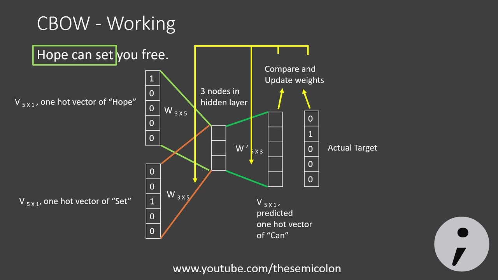

NLP :

>>parse tree vs Dependency Parsing tree

>>Netural language (processing)

>processing :

	johan loves icecreame, which is made by mary with love.

	1) tokanization
	
	2)lamatization : we understand about meaning of sentences.
			what is a lamatization?
			
	3) staming (choping of word)
		  	EX : Taking --> take

		--->Lemmatization and Stemming are Text Normalization techniques.
		--->use phrse insted of word to avoid issues.
		---> if we use deep learing then most of the we dont process lamatization and stamming not.
	
	4) vocab -> collection of laxical.
	
	Natural language - > formal language

>contax matrix :
	
    
Wt -- > target matrix     (V X latent_space(assume 300))
wc -- > weagiht matix(context)
m  -- > 

>markov assumption
>> gram modaling(also comes under distribution semantic) == words are independent of each of other( mutal independent ).
		<start_tag> johan loves icecream. <end_tag>
		BYGRAM MODEL
		probalblity = p(johan) U p(loves) U p(icecream)
		p(john | s) = .....

>> similarity vs relativenes

	language model vs models(gram, Bart, GPT) are diffrent

>>word2vac
	-> two modles
		> bag of word (distrivtion semantic)
		> skip gram

	>> word vac is ratu tota :> stochastic parrot (we work on traning time.)

	word2vac gives probablity.
	
	wor2vac with gram : 
                maximize skipgram

    CBOW :

    P(Wt | Wc)

    skip gram : 

    P(Wc | Wt)

>>skip gram :
        sel  fsuperwise technique

    Mc
    Wc
    Wt

    W^t -- > W^t(prime) = W

 
    softmax --  log-likelyhood loss function (distribtion)
        drow back -> train is deficital
                  -> chance to give pooro result
    
    sigmoid -- cross entropy loss [multicass classification]
    