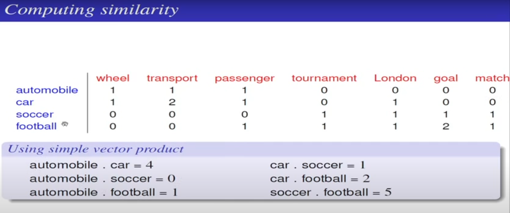

<h1 align = "center"> NLP NOTES</h1> 

> ## NLP VS NLU

>>NLP (Natural Language Processing): It understands the text's meaning. 
NLU (Natural Language Understanding): Whole processes such as decisions and actions are taken by it.

| NLP | NLU    |
| ---   | --- |
| From the computer’s point of view, any natural language is a free form text. That means there are no set keywords at set positions when providing an input.|NLU Considered a subtopic of NLP, the main focus of natural language understanding is to make machines: (1) Interpret the natural language  (2) Derive meaning  (3) Identify contex  (4) Draw insights |
|Beyond the unstructured nature, there can also be multiple ways to express something using a natural language. For example, consider these three sentences:  (1)How is the weather today? (2)Is it going to rain today? (3)Do I need to take my umbrella today?  All these sentences have the same underlying question, which is to enquire about today’s weather forecast.   As humans, we can identify such underlying similarities almost effortlessly and respond accordingly. But this is a problem for machines—any algorithm will need the input to be in a set format, and these three sentences vary in their structure and format. And if we decide to code rules for each and every combination of words in any natural language to help a machine understand, then things will get very complicated very quickly.    This is where NLP enters the picture.  NLP is a subset of AI tasked with enabling machines to interact using natural languages. The domain of NLP also ensures that machines can:  (1)Process large amounts of natural language data (2)Derive insights and information   But before any of this natural language processing can happen, the text needs to be standardized.|For example, in NLU, various ML algorithms are used to identify the sentiment, perform Name Entity Recognition (NER), process semantics, etc. NLU algorithms often operate on text that has already been standardized by text pre-processing steps.   Going back to our weather enquiry example, it is NLU which enables the machine to understand that those three different questions have the same underlying weather forecast query. After all, different sentences can mean the same thing, and, vice versa, the same words can mean different things depending on how they are used.   Let’s take another example:  (1)The banks will be closed for Thanksgiving. (2)The river will overflow the banks during floods.  A task called word sense disambiguation, which sits under the NLU umbrella, makes sure that the machine is able to understand the two different senses that the word “bank” is used.|

> ## Natural Language vs Formal Language

>Natural languages are the languages people speak,  such as English, Spanish, and French. They were not designed by people (although people try to impose some order on them); they evolved naturally.  
Formal languages are languages that are designed by people for specific applications.  For example, the notation that mathematicians use is a formal language that is particularly good at denoting relationships among numbers and symbols. Chemists use a formal language to represent the chemical structure of molecules. And most importantly:

| Aspect                 | Natural Language        | Formal Language         |
|------------------------|-------------------------|--------------------------|
| Definition             | Language spoken and written by humans in everyday communication | Language with precise syntax and semantics used in technical fields such as mathematics, logic, and computer science |
| Examples               | English, Spanish, Chinese, etc. | Regular expressions, context-free grammars, logic, SQL, etc. |
| Characteristics        | Flexible, ambiguous, context-dependent, variable in structure | Precise, structured, unambiguous, and consistent |
| NLP Tasks              | Sentiment analysis, named entity recognition, machine translation, etc. | Formal languages used in defining rules, grammars, or constraints for NLP tasks |
| Applications           | Text analysis, machine translation, virtual assistants, etc. | Text processing, parsing, knowledge representation, and querying |
| Role in NLP            | The subject of analysis and generation in NLP tasks | Used to create models, rules, and tools for processing natural language |
| Use Cases              | Understand and generate human language | Define syntax, constraints, and processing rules for NLP systems |
| Examples in NLP        | Sentiment analysis of customer reviews, machine translation of news articles | Defining grammars for parsing sentences, writing regular expressions for text extraction |

> ## Compositional Semantics vs Distributional Semantics

> **Compositional semantics** would involve breaking down the sentence into its constituent parts and deriving the meaning through structured representation and logical rules.  johan love ice-cream.  
In this case, we could break the sentence down into "Jon" (a proper noun), "loves" (a verb), and "ice-cream" (a noun). We would then apply semantic rules to combine these components.
The compositional approach would represent the sentence's meaning as something like "Love(Jon, ice-cream)," indicating that Jon has a positive sentiment towards ice-cream.

> **Distributional semantics** relies on word embeddings and the distribution of words in a corpus. It would represent the sentence by considering the contexts in which words appear.  
In a distributional model like Word2Vec or GloVe, the words "Jon," "loves," and "ice-cream" would each have vector representations based on their co-occurrence patterns with other words.  
The model might learn that "loves" and "ice-cream" tend to co-occur in similar contexts, indicating a semantic relationship. Therefore, they might have vectors that are close together in the vector space, while "Jon" would have its own vector representation.  
In this approach, the meaning of the sentence "Jon loves ice-cream" would be captured as the similarity or closeness in vector space between the vectors for "loves" and "ice-cream."
  

| Aspect                 | Compositional Semantics        | Distributional Semantics         |
|------------------------|-------------------------|--------------------------|
| Definition             | Derives meaning by composing the meanings of individual components (words or phrases) | Derives meaning from the distribution of words in a large corpus of text |
| Approach               | Relies on formal logic, predicate calculus, and structured representations | Utilizes vector space models, word embeddings, and machine learning techniques |
| Representation         | Typically uses structured representations and explicit semantic rules | Represents words and phrases as high-dimensional vectors based on co-occurrence |
| Example                | Deriving sentence meaning from the meanings of its words | Creating word embeddings (Word2Vec, GloVe) to capture semantic relationships |
| Use Cases              | Precise reasoning, logical inference, semantic rule-based tasks | Word similarity, document retrieval, data-driven tasks |
| Challenges             | Requires explicit linguistic knowledge, syntactic structure, and semantic rules | May struggle with capturing rare words and may not handle word polysemy well |
| Modern NLP            | Often used in conjunction with distributional semantics in hybrid approaches | Frequently used in conjunction with compositional semantics to leverage both approaches |

> # Polysemy VS Homonymy
| Aspect           | Polysemy                           | Homonymy                          |
|------------------|-----------------------------------|----------------------------------|
| Definition       | Multiple related meanings for a single word | Different words with the same form (spelling/pronunciation) but unrelated meanings |
| Semantic Relationship | The meanings are typically related by a common underlying concept | No inherent semantic relationship; distinct words that coincidentally share the same form |
| Examples         | - "Bank" can mean a financial institution or the side of a river. Both relate to the idea of a place where something is stored. - "Mouse" can refer to a small rodent or a computer input device. Both relate to the idea of something small that is manipulated or controlled. | - "Bark" can mean the sound a dog makes (verb) or the outer covering of a tree (noun). These two meanings have no semantic connection. - "Bat" can refer to a flying mammal or a piece of sports equipment used in baseball. These meanings are unrelated. |
| Context          | The specific meaning is often determined by context, making it context-dependent. | Context or additional information may be required to disambiguate the intended meaning. Without context, it can be challenging to determine the correct interpretation. |

> # TF-IDF

In the context of TF-IDF (Term Frequency-Inverse Document Frequency), information context is not explicitly computed, but it is indirectly taken into account when calculating the TF-IDF scores for words in a document corpus. 

TF-IDF is a numerical statistic used in information retrieval and text mining to represent the importance of a word within a collection of documents. It considers the local and global context of words. Here's how information context is indirectly incorporated into TF-IDF:

1. **Term Frequency (TF)**
   - The term frequency component (TF) measures how frequently a term (word) appears in a specific document. 
   - This is the local context of the word within a particular document.
   - It is calculated as the number of times a term appears in a document divided by the total number of terms in that document.
   - It represents the relevance of the term to the specific document.

2. **Inverse Document Frequency (IDF)**
   - The inverse document frequency component (IDF) takes into account the global context. 
   - It measures how unique or common a term is across the entire document corpus.
   - Words that appear in many documents are considered less important than words that appear in a smaller subset of documents.
   - IDF is calculated as the logarithm of the total number of documents divided by the number of documents containing the term.

3. **TF-IDF Score**
   - The TF-IDF score is computed by multiplying the TF and IDF components.
   - This score reflects both the local context of the term within the document and its global context within the entire corpus.
   - Words with high TF-IDF scores are those that are important and unique within the context of a specific document and across the entire corpus.

In this way, TF-IDF indirectly takes information context into account by weighting words based on their frequency within the document and their uniqueness or significance across the entire corpus. This allows TF-IDF to identify and prioritize words that are contextually relevant and important for a specific document while considering their importance in the broader context of the corpus.
